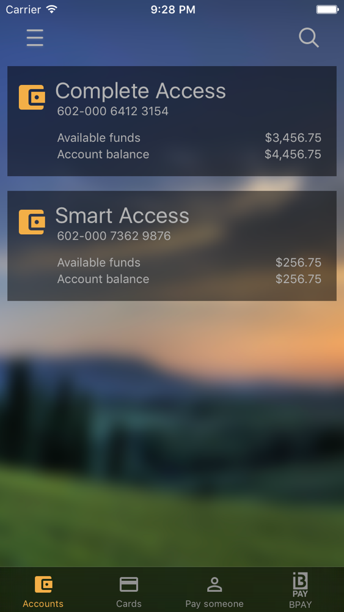
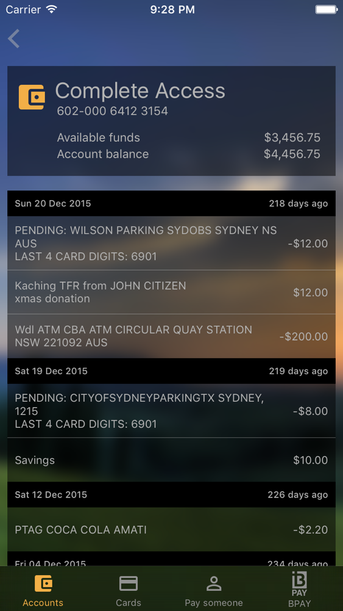

# Introduction to iOS Workshop

## Audience
* Software Engineer
    * Competent in another programming language
    * Knowledge of software engineering principles
* No prior experience developing on iOS necessary

## Course objective
Overview of iOS topics, techniques and paradigms, focussing on the most common scenarios.

At the end of this course, you should reach the minimum knowledge level necessary to contribute to hands-on iOS development on a scrum team, assuming you have further coaching and mentoring support on the team.

## Course structure
* Duration: 6 weeks, 2 sessions per week
* Sessions: Each session is around 1.5hr - 2hrs
* Sessions consist of combinations of:
    * Overview of concepts and theory
    * Demo of concepts in Playground, and hands on exercises
    * Applying concepts to create a real application, demo and hands on exercises
* Homework assignments to complete in your own time

## Prerequisites

Mac capable of running the latest version of Xcode. 

Download from the Mac App store, or from [https://developer.apple.com/xcode/download/](https://developer.apple.com/xcode/download/)

## Workshop Sessions Overview

### Session 1.1
* Introduction to Xcode - Hello World
    * Hands-on coding together session to create our first project
* Swift Playground
    * Variables & constants
    * Swift types
    * Control flow

### Session 1.2
* Thinking in AutoLayout
* Swift Playground
    * Functions
    * Optionals
    * Classes and structures
    * Properties and methods
    * Initialization
* Workshop project - models
    * JSON parsing
    * Unit test

### Session 2.1
* Swift Playground
    * Enumerations
    * Closures
    * Closures and UIView animations
    * Extensions

### Session 2.2
* Swift Playground
    * Protocols
    * Generics
    * Error handling
* Dependency management - Cocoapods
* Workshop project - models (continued)
    * Enums, Generics, Protocols
    * Async APIs
    * Async unit test

### Session 3.1
* Architecture - iOS layered architecture
* Workshop project - Basic UI
    * Asset catalogs, template images, tint
    * UIImageView
    * UILabel
    * AutoLayout
    * ViewController lifecycle
    * Include currency formatting logic in the model - NSNumberFormatter

### Session 3.2
* Short Video
    * ARC, weak/unowned, memory management
* Workshop project - UIView and Xib
    * Refactor into a reusable UIView and Xib
    * Adding designer support (Demo)
* UIView lifecycle

### Session 4.1
* Workshop project - Converting accounts view to a dynamic TableView
* Demo
    * Obj-C interoperability with Swift
    * Image blurring

### Session 4.2
* Tab bar 
* Navigation exercise
* View controller containment (quick demo)

### Session 5.1
* Swift playground
    * Functional programming in Swift
* Homework - Workshop project - Transactions Models
    * Date parsing and formatting
    * Applying functional techniques

### Session 5 Homework
Transactions Listing - Diving deeper into dynamic tableviews

### Session 5.2 
* Threading basics
* Workshop Exercises
    * Gesture Recognizers
    * Delegation pattern
    * Alerts and ActionSheets
    * Share sheet
* Settings bundle
	

### Session 6.1
* Application Lifecycle
* Data Persistence
* Workshop Exercises
    * ScrollView with AutoLayout
    * UITextField
* UIKit User Interface Catalog
* Closing

## Workshop Screenshots

### Accounts

### Transactions

## License

The material contained in this IntroWorkshop.iOS repository is available under the MIT license. See the LICENSE file for more info.
